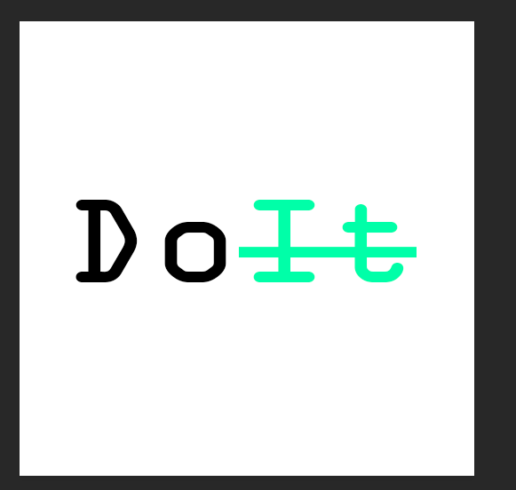

<!-- Improved compatibility of back to top link: See: https://github.com/othneildrew/Best-README-Template/pull/73 -->
<a name="readme-top"></a>
<!--
*** Thanks for checking out the Best-README-Template. If you have a suggestion
*** that would make this better, please fork the repo and create a pull request
*** or simply open an issue with the tag "enhancement".
*** Don't forget to give the project a star!
*** Thanks again! Now go create something AMAZING! :D
-->


<!-- PROJECT SHIELDS -->
<!--
*** I'm using markdown "reference style" links for readability.
*** Reference links are enclosed in brackets [ ] instead of parentheses ( ).
*** See the bottom of this document for the declaration of the reference variables
*** for contributors-url, forks-url, etc. This is an optional, concise syntax you may use.
*** https://www.markdownguide.org/basic-syntax/#reference-style-links
-->
[![Contributors][contributors-shield]][contributors-url]
[![Forks][forks-shield]][forks-url]
[![Stargazers][stars-shield]][stars-url]
[![Issues][issues-shield]][issues-url]
[![MIT License][license-shield]][license-url]
[![LinkedIn][linkedin-shield]][linkedin-url]


<!-- PROJECT LOGO -->
# Welcome to the Team DOIT Repository !
<br />
<div align="center">
  <a href="https://github.com/jhu-oose-f22/team-doit-project-repo">
    
  </a>

  <h3 align="center">Doit-Application-README</h3>

  <p align="center">
    An awesome application to find the better you!
    <br />
    <a href="https://github.com/jhu-oose-f22/team-doit-project-repo"><strong>Explore the docs »</strong></a>
    <br />
    <br />
    <a href="https://doit-oose.herokuapp.com/">View Demo</a>
    ·
    <a href="https://github.com/jhu-oose-f22/team-doit-project-repo/issues">Report Bug</a>
    ·
    <a href="https://github.com/jhu-oose-f22/team-doit-project-repo/issues">Request Feature</a>
  </p>
</div>


<!-- TABLE OF CONTENTS -->
<details>
  <summary>Table of Contents</summary>
  <ol>
    <li>
      <a href="#about-the-project">About The Project</a>
      <ul>
        <li><a href="#built-with">Built With</a></li>
      </ul>
    </li>
    <li>
      <a href="#getting-started">Getting Started</a>
      <ul>
        <li><a href="#prerequisites">Prerequisites</a></li>
        <li><a href="#installation">Installation</a></li>
      </ul>
    </li>
    <li><a href="#usage">Usage</a></li>
    <li><a href="#roadmap">Roadmap</a></li>
    <li><a href="#contributing">Contributing</a></li>
    <li><a href="#license">License</a></li>
    <li><a href="#contact">Contact</a></li>
    <li><a href="#acknowledgments">Acknowledgments</a></li>
  </ol>
</details>

<br>


<!-- ABOUT THE PROJECT -->
## About The Project

<!-- [![Product Name Screen Shot][product-screenshot]](https://example.com) -->

The purpose of the DoIt application is to help you stay focused and motivated on the important things in life. Whenever you want to stay focused or show off your accomplishments to your circle of friends, use DoIt and place a bet. Stay motivated daily and turn hard work into a handful of DoIt coins. In the future, we believe that DoIt would be a popular productivity app that helps people beat their laziness and reach their goals in an interesting and pleasant way. 

Here's why:
* People often feel unmotivated and discouraged to do academic, professional, and personal tasks. :sob:
* There currently are only to-do list applications that allow you to list and plan the tasks that you need to complete. 
* The market is lacking a solution that focuses on actually pushing users to actually do the tasks! DoIt is our solution to these problems. :relaxed:

Through the betting system in Dolt, users need a certain amount of Dolt coins to play the game. Users can set private tasks for themselves or set tasks for everyone in a group. For group tasks, other people will keep track of them by verifying their public social media posts or private group posts. The user who fails to do their tasks will lose coins and the rest of the users will spilt the coins evenly. Successful users will be able to help friends gain better habits, get tasks done, earn more coins along the way, and have the opportunity to upload content to the general public. In this way, people are more motivated by losses rather then gains, so we want to motivate people by introducing consequences. We also allow them to be motivated by recognition and followers across our social platform.

Types of Coins:
* Paid coins (Correspond to real money)
* Free coins (Earn through daily checkin)

Either coins work well in our betting system. The existence of free coins allows users to complete tasks under the supervision of others (and face possible consequences) while enjoying the fun of gaining community recognition and rewards when friends fail to do tasks.

<p align="right">(<a href="#readme-top">back to top</a>)</p>


### Built With

Here are major frameworks/libraries we used to build our project.

* [![Node.js][Node.js.com]][Node.js-url]
* [![React][React.js]][React-url]
* [![Express][Express.com]][Express-url]
* [![Bootstrap][Bootstrap.com]][Bootstrap-url]
* [![MongoDB][MongoDB.com]][MongoDB-url]
* [![MaterialUI][mui.com]][mui-url]
* [![Axios][axios-http.com]][axios-http-url]
* [![getstream][getstream-http.com]][getstream-http-url]
* [![heroku][heroku-http.com]][heroku-http-url]


<p align="right">(<a href="#readme-top">back to top</a>)</p>


<!-- GETTING STARTED -->
## Getting Started

View a deployed version of our website here: https://doit-oose.herokuapp.com/

### Installation

1. Navigate to the ```server``` folder and run ```npm i --force``` to install all dependencies. 

2. Next run the following code to start the server
```sh
node index.js
```
3. Navigate to the ```frontend``` folder and run ```npm i --force``` to install all dependencies. 
   
4. Run the following code to start the frontend
  ```sh
  npm run start
  ```
5. You should be directed to ```http://localhost:3000/```


<!-- USAGE EXAMPLES -->
## Usage

This section shows how to use the DoIt web app. How-to instructions, screenshots, code examples, demos, and links to more resources may be included here.

### Iteration 1 - Usage
1. Please use the Register button to create a new account (password is optional, not implemented for this iteration yet)

2. Please use the Login button to login to your account
3. Once you login, please click on the home button on your screen
4. You can click a plus button on the right side of the screen to add a task for yourself
5. Please enter the fields for the task then click confirm (may have to double click)

### Iteration 2 - Usage
1. After logging in and registering, you can see a navigation bar at the top with a search bar and your profile picture.
2. You can type the name of a group that you want to join in the search bar and press enter, and the matching results should appear. To join a group that appears in your search results, you can click its group card that appears and press the "Join group" button. Then, on the left sidebar, a new group icon should appear for that group, meaning you have joined the group. You can also click the group icon to view the group.

3. You can click on your profile picture to see a drop-down menu of the number of coins you have and other stats. You can also log out using a button on this drop-down menu.

4. On the left hand side of the screen are buttons for creating a group and for opening up groups that you have already joined.
5. To create a group, please press the "Create Group" button and please name your group in the field, then please press "Confirm". The group should appear on the left sidebar as a new group icon.

6. To view/open a group, please click on the corresponding icon on the left sidebar. The group chat will open in the middle of the screen, and on the right will be a vertical list of tasks that belong to the group as a whole. You can also click the blue plus button on the right to add a task for the entire group.


1. If you are currently viewing a group and want to return to the home view, please press the "Close Chat" button on the left sidebar. Your personal tasks will appear again, and you can press the blue plus button to add more personal tasks for yourself (unrelated to any group).


### Iteration 3 - Usage
1. After logging in and registering, you can see a create group botton on the bottom left.
2. As a user creates a new group, the chat will automatically create. In the chat, you will see the chat history for the group and you will receive notifications when a new member join the chat. At the same time, users can also send images to the chat and share progress of the task
3. Also, when users create a new group, the invitation code will generate on the top right side of the page. 
User can click "COPY INVITE LINK TO CLIPBOARD" to copy the invitation code.

And a user's friends can put the invitation code into the search bar on the top and join the group.
4. When a user creates a group task, the task card shows the percentage of group members that have completed the task. And when a user in the group completes the task, they can click submit and the progress bar will change automatically.


### Iteration 4 - Usage
Deployed website: https://doit-oose.herokuapp.com/

1. As a new user, once you get into the home page, you can see the login page. You have the option to register an account in DO/It with your password. In addition, you can choose to login via Google/Meta account.
2. If you choose to create a DO/It account, then you are welcome to do so in our register page.)
3. Users who want to login via their Google/Meta account can just click the relevant button, and a pop up page will appear asking you credentials from the relevant companies. 
4. When choosing login via Google/Meta, your DO/It profile (name, email, etc) will be matched with your Google/Meta profile so users don't have to worry for trouble.


_For more examples and documentation, please refer to the [doc folder in this repo](https://github.com/jhu-oose-f22/team-doit-project-repo/tree/main/doc) which contains the SRS and the UML diagram._

<p align="right">(<a href="#readme-top">back to top</a>)</p>


<!-- ROADMAP -->
## Roadmap (User Stories Completed)

### Iteration 1 

#### User Stories (original) Completed on Iteration 1
- [x] As a user, I want to be able to create tasks for myself to complete  
- [x] As a user, I want to be able to enter a certain number of coins to the pool with my friends when setting up a task  
- [x] As a user, I want to be able to enter a due date or time for when the task is due so that I can be held accountable by others to complete tasks on time

#### More specific User Stories Completed on Iteration 1
- [x] As developers, we want to setup mongodb and backend express
- [x] As a developer and as a user, I want to be able to differentiate users from each other so I know who has which tasks.
- [x] As developers, we want to create mongoose Schema for Task
- [x] As devs, we want to setup react frontend
- [x] As developers, we want to connect to the MongoDB database
- [x] As a user, will help Taiming with linking up backend server express js logic with the mongodb database using postman
- [x] As a user, will link up express js logic with posting the createUser to the backend and storing users in db with CRUD logic
- [x] As developers, we want to create mongoose Schema for User
- [x] As a user, users should see a chatbox
- [x] As a user, will have a login functionality with username
- [x] As a user, I want to be able to set the coin value of a task so I can say how much a task is worth.
- Note: if you refresh you will be logged out and will need to login again. Currently you need to create a new task to be able to see your previous task cards (will implement next iteration)

### Iteration 2

#### Iteration 2 User Stories Completed (original)
- [x] As a user, I want to be able to search for groups using groupname
- [x] As a user, I want to be able to join groups after searching for them
- [x] As a user, I want to be able to create a group
- [x] As a user, I want to see a list of groups that are associated with me
- [x] As a user, I want to create tasks for a group
- [x] As a user, I want to see the list of tasks that are assigned with a group
- [x] As a user, I want to be able to click on group icons to show a separate group window

#### Iteration 2 User Stories Completed (more specific)
- [x] When a user creates a group or enters a new group through search, a new group button is shown on the left hand side
- [x] The API for createGroupTask will be updated, and updates will also be made to the createGroup API, User, Task, Group Schema
- [x] A Group Card will have a separate chat section (non functional) and task section that shows tasks for group.
- [x] Private task cards will render for the user on their homepage in a grid with a better looking frontend
- [x] Search bar works to display searched group and has button to join
- [x] "Create Group" button on homepage to create new group

### Iteration 3

#### Iteration 3 User Stories Completed (original)
- [x] As a user, I want to be able to create or join private groups with my friends so we can have fun while holding each other accountable for the tasks
- [x] As a user, I want to be able to send messages and post pictures in the group chat so I can talk with my friends and verify I have completed tasks
- [x] As a user, I want to be able to invite a user to a group so they can join the group using the invite

#### Iteration 3 User Stories Completed (more specific)
- [x] As a user, I want to be able to send messages to others in the group chat so that we can discuss each others' progress
- [x] As a user, I want to be able to see chat history when I log in so that we can see what happened
- [x] As a user, I want to be able to upload pictures to group chat so that we can share progress
- [x] As a user, I want to be able to have a separate chat when I create group or join group
- [x] As a user, a random invitation code will be generate when I try to create a group and my friend can use that code to join the group as well.
- [x] As a user, we hope to have the option of a group invitation code for joining groups so that friends can join the group through invitation code.
- [x] As a user, I want to set my profile picture (with scaling and rotating image options) so that other users can identify me easily
- [x] As a user, I want to set the picture of the group so that the group is easily identifiable in the sidebar of groups
- [x] As a user, I want to be able to create private groups that are password-protected so that only my friends who know the password can join
- [x] As a user, I want to be able to create private groups that are cost-protected, meaning only users with above a certain threshold of coins can join, so that I can form a group with experienced members with more coins
- [x] As a user, I want to be able to leave a group so that I am not in the group anymore
- [x] As a user, I want to be able to interact with task cards so that coin values can be redeemed upon task completion and checkboxes for “Task Done” or "Submit" can be selected by users
- [x] Refactor all class components into function components

### Iteration 4

#### Iteration 4 User Stories Completed (original)
- [x] As a user, I want to have a secure way of logging into my account
- [x] As a user, I want to be notified about the progress of other members in the group

#### Iteration 4 User Stories Completed (more specific)
- [X] As developers, we want to have a backend codebase that is easily navigable with functions refactored into specific files (not all in index.js)
- [x] Google Login
- [x] Facebook Login
- [x] DoIt Login
- [x] Move display of personal tasks to profile page
- [X] Seperate Backend into different files

### Iteration 5

- [x] As a user, I want a better looking landing page, with same sized buttons, doit logo
- [x] As a user, I want better looking task cards UI
- [x] As a user, I want to see a doit logo
- [x] As a user, I want a better looking create group UI
- [x] As a user, I want a group of useful buttons on home page
- [x] As a user, I want the UI to be user-friendly and easily navigable in the program
- [x] As a user, I want a pie chart to show private task progress
- [x] As a user, I want a slideshow with data for my groups


Please see the [Team DoIt Project Backlog](https://github.com/orgs/jhu-oose-f22/projects/8/views/1) for a full list of user stories for current and upcoming iterations.

<p align="right">(<a href="#readme-top">back to top</a>)</p>


<!-- CONTRIBUTING -->
## Contributing

Contributions are what make the development community such an amazing place to learn, inspire, and create. Any contributions you make are **greatly appreciated**.

If you have a suggestion that would make this better, please fork this repo and create a pull request. Please feel free to reach out to one of the Team DoIt Members below via email to contact us, too! We'd love to talk.

Don't forget to give the project a star! :star: Thanks again!

1. Fork the Project
2. Create your Feature Branch (`git checkout -b`)
3. Commit your Changes (`git commit -m 'RandomMessage'`)
4. Push to the Branch (`git push origin`)
5. Open a Pull Request

### Steps to Run Locally
1. Run 'npm run install-all' to install all dependencies for both the frontend and backend
2. cd into server folder, then run node index.js to start the server on port 5000
3. In a new terminal, cd into the frontend folder and run npm start to start the frontend on port 3000

Note: To switch between using the Heroku backend and the local backend, change the URL in the frontend/src/axiosSettings.js file to the URL of the backend you want to use.
For example, if you want to use the Heroku backend, change the URL to 'https://backend-oose-doit.herokuapp.com/'
For example, if you want to use the local backend, change the URL to 'http://localhost:5000/'


<p align="right">(<a href="#readme-top">back to top</a>)</p>


<!-- CONTACT -->
## Contact

### Team DoIt Project Members (listed in alphabetical order):

- Jonathan Bakhit - [@syncre02](https://github.com/syncre02) - jbakhit1@jhu.edu
- Yujian (Ken) He - [@Kennnnn774](https://github.com/Kennnnn774) - yhe99@jhu.edu
- Christopher Li - [@cli135](https://github.com/cli135) - cli135@jhu.edu
- Taiming Shi - [@tshi13](https://github.com/tshi13) - tshi13@jhu.edu
- Shaopeng Zeng - [@SP-Zeng](https://github.com/SP-Zeng) - szeng10@jhu.edu
- Ian Zheng - [@ianzhg](https://github.com/ianzhg) - yzheng67@jhu.edu

Project Link: [https://github.com/jhu-oose-f22/team-doit-project-repo](https://github.com/jhu-oose-f22/team-doit-project-repo)

<p align="right">(<a href="#readme-top">back to top</a>)</p>


<!-- ACKNOWLEDGMENTS -->
## Acknowledgments

We are thankful for these resources which have helped us on our development journey:

* [Choose an Open Source License](https://choosealicense.com)
* [Material UI](https://mui.com)
* [StackOverflow](https://stackoverflow.com)
* [GitHub Emoji Cheat Sheet](https://www.webpagefx.com/tools/emoji-cheat-sheet)
* [Img Shields](https://shields.io)
* [GitHub Pages](https://pages.github.com)

<p align="right">(<a href="#readme-top">back to top</a>)</p>


<!-- MARKDOWN LINKS & IMAGES -->
<!-- https://www.markdownguide.org/basic-syntax/#reference-style-links -->
[contributors-shield]: https://img.shields.io/github/contributors/othneildrew/Best-README-Template.svg?style=for-the-badge
[contributors-url]: https://github.com/jhu-oose-f22/team-doit-project-repo/graphs/contributors
[forks-shield]: https://img.shields.io/github/forks/othneildrew/Best-README-Template.svg?style=for-the-badge
[forks-url]: https://github.com/jhu-oose-f22/team-doit-project-repo/network/members
[stars-shield]: https://img.shields.io/github/stars/othneildrew/Best-README-Template.svg?style=for-the-badge
[stars-url]: https://github.com/jhu-oose-f22/team-doit-project-repo/stargazers
[issues-shield]: https://img.shields.io/github/issues/othneildrew/Best-README-Template.svg?style=for-the-badge
[issues-url]: https://github.com/jhu-oose-f22/team-doit-project-repo/issues
[license-shield]: https://img.shields.io/github/license/othneildrew/Best-README-Template.svg?style=for-the-badge
[license-url]: https://github.com/othneildrew/Best-README-Template/blob/master/LICENSE.txt
[linkedin-shield]: https://img.shields.io/badge/-LinkedIn-black.svg?style=for-the-badge&logo=linkedin&colorB=555
[linkedin-url]: https://linkedin.com/in/othneildrew
[product-screenshot]: images/screenshot.png
[Next.js]: https://img.shields.io/badge/next.js-000000?style=for-the-badge&logo=nextdotjs&logoColor=white
[Next-url]: https://nextjs.org/
[React.js]: https://img.shields.io/badge/React-20232A?style=for-the-badge&logo=react&logoColor=61DAFB
[React-url]: https://reactjs.org/
[Vue.js]: https://img.shields.io/badge/Vue.js-35495E?style=for-the-badge&logo=vuedotjs&logoColor=4FC08D
[Vue-url]: https://vuejs.org/
[Angular.io]: https://img.shields.io/badge/Angular-DD0031?style=for-the-badge&logo=angular&logoColor=white
[Angular-url]: https://angular.io/
[Svelte.dev]: https://img.shields.io/badge/Svelte-4A4A55?style=for-the-badge&logo=svelte&logoColor=FF3E00
[Svelte-url]: https://svelte.dev/
[Laravel.com]: https://img.shields.io/badge/Laravel-FF2D20?style=for-the-badge&logo=laravel&logoColor=white
[Laravel-url]: https://laravel.com
[Bootstrap.com]: https://img.shields.io/badge/Bootstrap-563D7C?style=for-the-badge&logo=bootstrap&logoColor=white
[Bootstrap-url]: https://getbootstrap.com
[MongoDB.com]: https://img.shields.io/badge/MongoDB-47A248?style=for-the-badge&logo=mongodb&logoColor=white
[MongoDB-url]: https://www.mongodb.com/ 
[Express.com]: https://img.shields.io/badge/Express-000000?style=for-the-badge&logo=express&logoColor=white
[Express-url]: https://expressjs.com/
[Node.js.com]: https://img.shields.io/badge/Node.js-339933?style=for-the-badge&logo=nodedotjs&logoColor=white
[Node.js-url]: https://nodejs.org/en/
[mui.com]: https://img.shields.io/badge/MaterialUI-007FFF?style=for-the-badge&logo=mui&logoColor=white
[mui-url]: https://mui.com
[axios-http.com]: https://img.shields.io/badge/Axios-5A29E4?style=for-the-badge&logo=axios&logoColor=white
[axios-http-url]: https://axios-http.com/docs/intro
[getstream-http.com]: https://img.shields.io/badge/Streamlit-FF4B4B?style=for-the-badge&logo=streamlit&logoColor=white
[getstream-http-url]: https://getstream.io/
[heroku-http.com]: https://img.shields.io/badge/Heroku-430098?style=for-the-badge&logo=heroku&logoColor=white
[heroku-http-url]: https://www.heroku.com/


